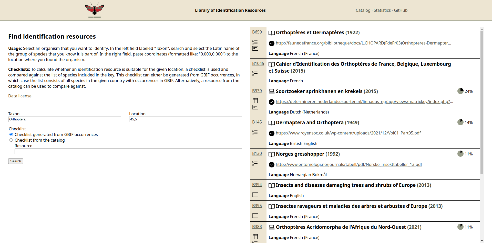

# Proof-of-Concept

Query the [catalog](https://github.com/identification-resources/catalog) of identification resources based on a taxon and a location.

## License

The code in this repository is licensed under the [MIT license](https://github.com/identification-resources/proof-of-concept/blob/main/LICENSE).
The site retrieves data from the [GBIF REST API](https://www.gbif.org/developer/summary), the [iNaturalist API](https://api.inaturalist.org/v1/docs/),
and the [Wikidata](https://www.wikidata.org/) [Query Service](https://query.wikidata.org/), and opens certain links to external sites in an
[iframe](https://developer.mozilla.org/en-US/docs/Web/HTML/Element/iframe); this content does not fall under the aformentioned license.
